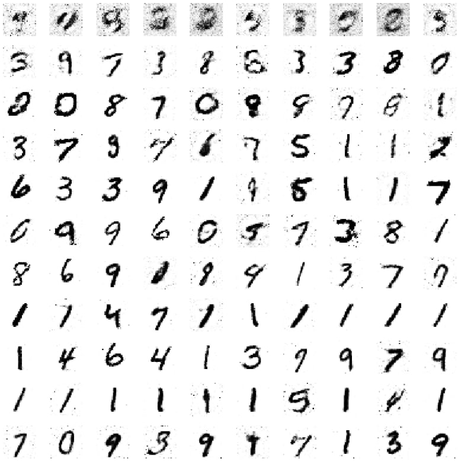
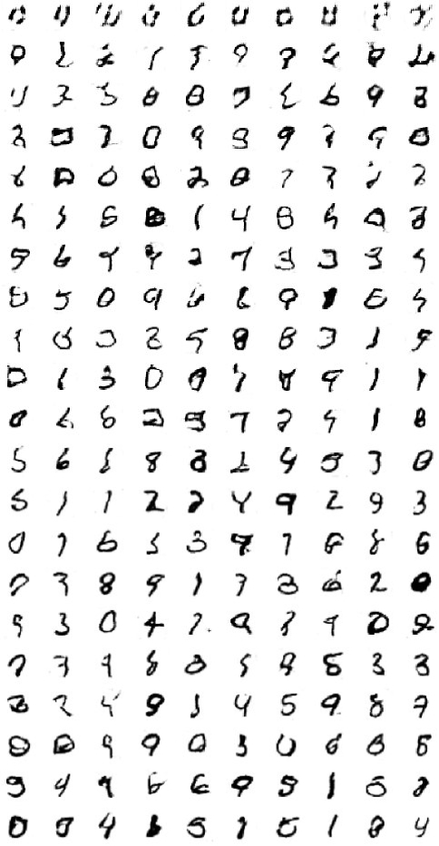

# ai_digit_generator
 
**GAN for Digit Generation**

This project implements a Generative Adversarial Network for generating handwritten digit images. GANs consist of two neural networks, a generator, and a discriminator, which are trained in a competitive manner. The generator tries to produce realistic data, while the discriminator aims to distinguish between real and generated data.

**Result**

**gan result**

**dcgun result**

**Dependencies:**

Python 3.x

TensorFlow

NumPy

Matplotlib

**Usage**

Clone this repository to your local machine:

`git clone https://github.com/zepif/ai_number_generator.git`

Ensure you have the required dependencies installed. You can install them using pip:

`pip install tensorflow numpy matplotlib`

Run the gan.py script to train the GAN:

`python main.py --architecture ...`

It could be 'gan1' to run gan or 'gan2' to run dcgan

The GAN/DCGAN will begin training and generate digit images over epochs. Generated images will be saved to the numbers directory. 

You can adjust the number of training epochs, batch size in the gan.py/dcgan.py script or you can change other parameters in generator.py/discriminator.py to experiment with the training process.

**Project Structure**

main.py: The main script that defines gpu, the GAN and DCGAN class, loads data, trains the models, and generates images. 

gan.py: Contains GAN class for training and generating.

dcgan.py: Contains DCGAN class for training and generating.

data_loader.py: Contains a DataLoader class for loading and preprocessing the MNIST dataset.

discriminator.py: Defines the Discriminator neural network.

generator.py: Defines the Generator neural network.

numbers/: A directory to store generated digit images.
